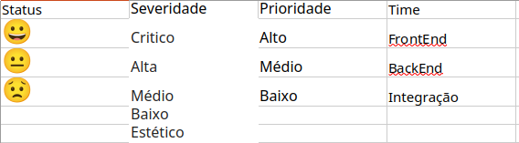

# TestesManuais_TodoMVC

Projeto de Criação do Upstream, Plano de Teste e Bugtracking

**Sobre o projeto:**

O objetivo desse projeto é criar todas as fases do fluxo de desenvolvimento de software na abordagem do QA para a página web https://todomvc.com/examples/react/dist/.

O TodoMVC é um projeto open source que fornece um aplicativo de referência que implementa uma lista básica de tarefas de forma interativa, um checklist para acompanhar tarefa adicionadas referentes a uma tecnologia.

Observação: A tecnologia escolhida no TodoMVC foi o React, mas isso não influenciou no projeto, pois o objetivo é analisar o comportamento e as funcionalidades do site quando uma tecnologia é definida.

**Sobre o curso:**

Curso Teste de Software Manual: Do Planejamento à Execução, realizado através da plataforma Udemy e ministrado pela Qualiters Club.

**Tarefas:**
1. Identificar todos os épicos das atividades da página https://todomvc.com/examples/react/dist/;
2. Em cada épico inserir evidência através de print, nome da funcionalidade, user history (história do usuário), regras de negócio e critérios de aceite;
3. Criação da tabela macros, onde se localiza toda as configurações das tabelas de plano de teste;
4. Criação da tabela introdução, contendo as informações iniciais gerais do plano de teste, as motivações, informações técnicas, regras, ferramentas e links;
5. Criação da tabela escopo de teste, onde vai conter os requisitos e as suas devidas informações;
6. Tabelas de cada suíte de teste, contendo informações sobre a suíte e também sobre o status dos testes;
7. Criação da tabela de controle de bugs, Identificação, com os dados do testador, do ambiente a ser testado e os objetivos do teste;
8. Criação da tabela de macro, para as configurações da tabela de controle de defeitos;
9. Criação da tabela controle de defeitos, para realizar o acompanhamento dos bugs abertos.

**Ferramentas:**

**Miro:** Plataforma online colaborativa. Onde foi realizada a criação do Upstream;

**LibreOffice Calc:** Programa destinado à criação de planilhas e tabelas. Onde foram documentadas as tabelas de plano de teste e a tabela de acompanhamento de bugs;

**Flameshot:** Ferramenta gratuita, de código aberto e multiplataforma para fazer capturas de tela com muitos recursos integrados. Foi utilizado para capturar as evidências no formato de print;

**Kazam:** Programa de gravação de tela que captura o conteúdo da sua tela e grava um arquivo de vídeo que pode ser reproduzido por qualquer reprodutor de vídeo. Foi utilizado para capturar as evidência no formato de vídeo.

**Desenvolvimento:**

Para iniciar, foi identificado os épicos, e em cada estágio da tela, foram capturadas evidências. Depois foi a vez de criar um board no Miro e inserir as evidências, e abaixo de cada evidência foi inserido o nome da sua funcionalidade, após isso a história do usuário, e depois os critérios de aceite, que foram escritos utilizando a técnica de escrita Gherkin.

Depois vem a criação das tabelas do Plano de Teste, começando pelo de macros, que deve conter as configurações das tabelas do plano de teste.

Em seguida a tabela de introdução, onde se localiza a apresentação do projeto.

Logo após, tabela de escopo do teste. Onde está listada as funcionalidades a serem testadas, sendo uma forma de controlar os entregáveis do plano de teste.

Por fim, temos as tabelas de suítes, cada requisito com a sua devida tabela, onde encontramos as informações gerais para a realização dos testes da suíte em questão, e campos com os seus critérios, métricas e resultados gerados.

Após as tabelas de plano de testes, temos as tabelas de controle de bugs, onde começamos com a tabela de identificação, com as informações iniciais do objeto a ser testado, informações do profissional responsável pelos bugs encontrados, os usuários impactados, os objetivos, datas de início e término e as referências para a realização da atividade.

Após isso, é criada a tabela de macro com as configurações para o controle de bugs.

Por fim, a criação da tabela de controle de defeitos, onde vai ser inserida as informações dos bugs que forem sendo encontrados, e através dela os defeitos serão acompanhados e retestados, até que venham a ser corrigidos.

Depois de criação das tabelas, é hora de começar a executar os testes com base no plano de teste criado. Na tabela de escopo de teste, é analisada a prioridade e a severidade dos testes, a prioridade definindo o quanto esse requisito é importante para o cliente e a severidade, do quanto esse requisito impacta em todo o sistema, com isso a escolha da ordem de execução é feita através de uma análise desses dois campos. Selecionada a funcionalidade, vamos para a sua tabela da suíte de teste, se nessa tabela conter mais de uma validação, é definida a ordem de execução da mesma forma que foi ordenada as execuções das funcionalidades. Com isso definido, o protótipo é acessado e se inicia os testes, sempre em cada teste, é necessário recolher as evidências, através de prints ou vídeos, a escolha vai depender de como o resultado daquela execução se mostra para o usuário, por exemplo, se é exibido de uma forma mais estática, o print é a opção, se for de uma forma mais dinâmica, recomenda-se a gravação de vídeo.
Esses arquivos das evidências são armazenados em pastas, com a pasta principal com o nome do plano de teste, as pastas seguintes com o nome de cada suíte, e as pastas que se localizam dentro dessas suítes, cada uma com a sua ID correspondente, onde vai ficar armazenado cada evidência.

No final de cada execução, é inserido na tabela de suíte o resultado obtido, o defeito se houver e o status. No resultado obtido informa se foi ou não foi detectado bug, em defeitos uma breve descrição do bug se encontrado e em status um emoji, que seria carinha feliz se há ausência de bugs ativos, carinha triste se um bug com alto impacto esteja ativo, e por fim, carinha séria, se for encontrado um bug de baixo impacto em atividade. Também é atualizado na tabela de escopo o valor atual da quantidade de validações que obtiveram sucesso na funcionalidade, e quando necessário, atualizar a data atual da execução.

Quando um bug é detectado, além das atualizações mencionadas anteriormente, também é necessário atualizar a tabela de controle de bugs, indo na seção de controle de defeitos e inserindo os dados necessários, para que esse defeito em vigor seja registrado e acompanhado, para que depois do esperado ajuste, essa funcionalidade seja retestada. O desenvolvedor deve ter acesso a essa planilha, para que ocorra os ajustes necessários. Se o bug for eliminado e logo em seguida surgir um outro bug na mesma funcionalidade, a tabela vai ser atualizada para que o desenvolvedor faça um novo ajuste, até que o testador não detecte defeitos na validação. Com a validação sem bugs encontrados e corrigidos, atualizamos o status dessa validação para emoji de carinha feliz na tabela de controle de defeitos, e em plano de teste, na tabela de escopo atualizamos a tabela de valor atual com a quantidade de mais um, e na suíte da funcionalidade dessa validação, também atualizamos o status com emoji de carinha feliz. Esses passos são feitos em cada validação.

**Acessar arquivos e evidências:**

[Upstream](https://github.com/oalessandrolima/TestesManuais_TodoMVC/blob/main/UpstreamTodoMVC.pdf)

[Plano de Teste](https://github.com/oalessandrolima/TestesManuais_TodoMVC/blob/main/PlanoDeTesteTodoMVC.xlsx)

[Controle de Bugs](https://github.com/oalessandrolima/TestesManuais_TodoMVC/blob/main/ControleDeBugsTodoMVC.xlsx)

[Evidências das execuções](https://drive.google.com/drive/folders/1EkgYeGSFQ_RCohQhzrmVFsF0g3hRY9Dk?usp=sharing)
